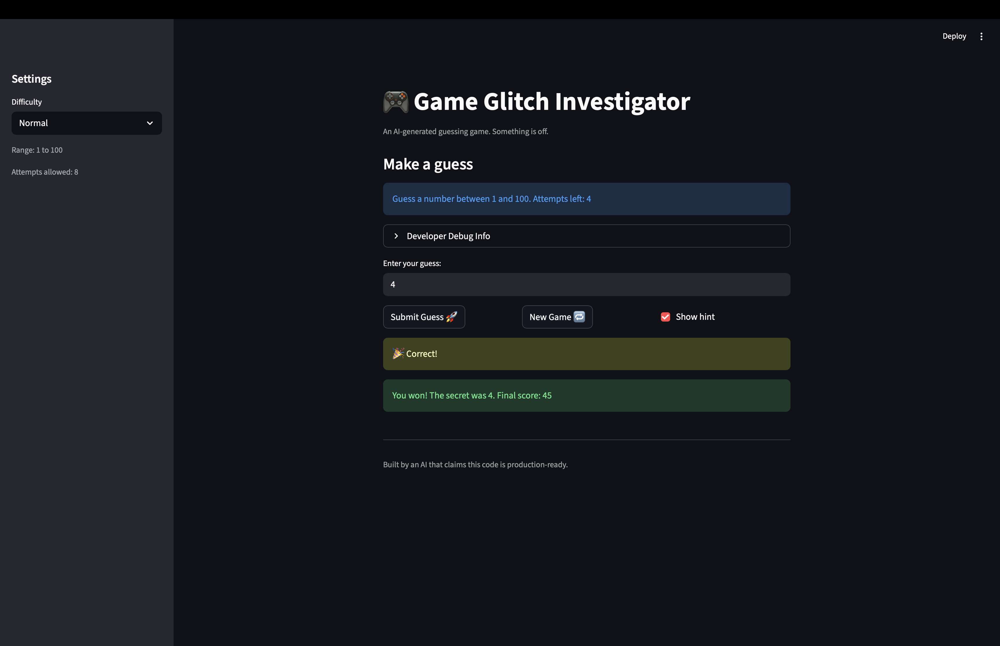

# 🎮 Game Glitch Investigator: The Impossible Guesser

## 🚨 The Situation

You asked an AI to build a simple "Number Guessing Game" using Streamlit.
It wrote the code, ran away, and now the game is unplayable. 

- You can't win.
- The hints lie to you.
- The secret number seems to have commitment issues.

## 🛠️ Setup

1. Install dependencies: `pip install -r requirements.txt`
2. Run the broken app: `python -m streamlit run app.py`

## 🕵️‍♂️ Your Mission

1. **Play the game.** Open the "Developer Debug Info" tab in the app to see the secret number. Try to win.
2. **Find the State Bug.** Why does the secret number change every time you click "Submit"? Ask ChatGPT: *"How do I keep a variable from resetting in Streamlit when I click a button?"*
3. **Fix the Logic.** The hints ("Higher/Lower") are wrong. Fix them.
4. **Refactor & Test.** - Move the logic into `logic_utils.py`.
   - Run `pytest` in your terminal.
   - Keep fixing until all tests pass!

## 📝 Document Your Experience

- [x] Describe the game's purpose.
- [x] Detail which bugs you found.
- [x] Explain what fixes you applied.

**Game purpose:** A number-guessing game where the player guesses a number within a range (Easy 1–20, Normal 1–100, Hard 1–50). The app gives hints (Go HIGHER! / Go LOWER!) and tracks attempts and score until you win or run out of attempts.

**Bugs found:** (1) Hints were backwards—too high showed "Go HIGHER!" instead of "Go LOWER!". (2) The secret was sometimes compared as a string (every other attempt), causing wrong or inconsistent hints. (3) New Game and the info text always used 1–100 instead of the selected difficulty range.

**Fixes applied:** Refactored core logic into `logic_utils.py`. In `check_guess`, fixed hint messages so "Too High" → "Go LOWER!" and "Too Low" → "Go HIGHER!". Always pass the secret as an int (removed the even/odd string conversion). New Game and the displayed range now use `get_range_for_difficulty(difficulty)` so they respect Easy/Normal/Hard.

## 📸 Demo

## 🚀 Stretch Features

- [ ] [If you choose to complete Challenge 4, insert a screenshot of your Enhanced Game UI here]
