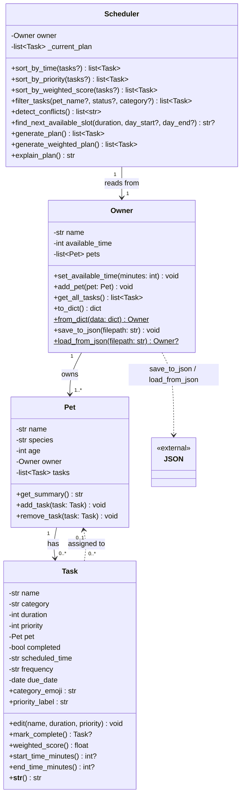

# PawPal+ UML Class Diagram

```mermaid
classDiagram
    class Owner {
        -str name
        -int available_time
        -list~Pet~ pets
        +set_available_time(minutes: int) void
        +add_pet(pet: Pet) void
        +get_all_tasks() list~Task~
        +to_dict() dict
        +from_dict(data: dict)$ Owner
        +save_to_json(filepath: str) void
        +load_from_json(filepath: str)$ Owner?
    }

    class Pet {
        -str name
        -str species
        -int age
        -Owner owner
        -list~Task~ tasks
        +get_summary() str
        +add_task(task: Task) void
        +remove_task(task: Task) void
    }

    class Task {
        -str name
        -str category
        -int duration
        -int priority
        -Pet pet
        -bool completed
        -str scheduled_time
        -str frequency
        -date due_date
        +edit(name, duration, priority) void
        +mark_complete() Task?
        +weighted_score() float
        +start_time_minutes() int?
        +end_time_minutes() int?
        +category_emoji : str
        +priority_label : str
        +__str__() str
    }

    class Scheduler {
        -Owner owner
        -list~Task~ _current_plan
        +sort_by_time(tasks?) list~Task~
        +sort_by_priority(tasks?) list~Task~
        +sort_by_weighted_score(tasks?) list~Task~
        +filter_tasks(pet_name?, status?, category?) list~Task~
        +detect_conflicts() list~str~
        +find_next_available_slot(duration, day_start?, day_end?) str?
        +generate_plan() list~Task~
        +generate_weighted_plan() list~Task~
        +explain_plan() str
    }

    Owner "1" --> "1..*" Pet : owns
    Pet "1" --> "0..*" Task : has
    Scheduler "1" --> "1" Owner : reads from
    Task "0..*" ..> "0..1" Pet : assigned to
    class JSON {
        <<external>>
    }
    Owner ..> JSON : save_to_json / load_from_json
```
