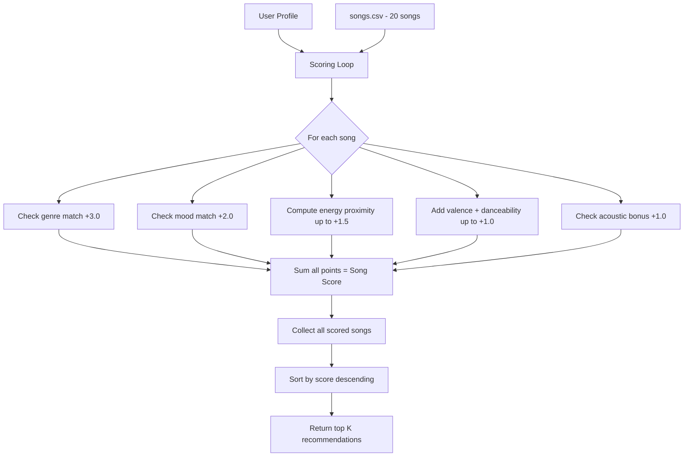

# 🎵 Music Recommender Simulation

## Project Summary

In this project you will build and explain a small music recommender system.

Your goal is to:

- Represent songs and a user "taste profile" as data
- Design a scoring rule that turns that data into recommendations
- Evaluate what your system gets right and wrong
- Reflect on how this mirrors real world AI recommenders

This project is a content-based music recommender simulation. It takes a user's taste profile (preferred genre, mood, energy level, and acoustic preference) and scores every song in a small catalog to surface the top matches. The system uses a weighted scoring rule that rewards both exact categorical matches (genre, mood) and numerical closeness (energy), mimicking how real platforms like Spotify blend multiple signals into a single relevance score.

---

## How The System Works

### How Real-World Recommenders Work

Platforms like Spotify and YouTube combine two main strategies:

- **Collaborative filtering** — "users who liked song A also liked song B." This approach does not need to understand anything about the songs themselves; it finds patterns across millions of listening histories. It is powerful but requires large datasets and can create popularity bias (popular songs get recommended more, making them more popular).
- **Content-based filtering** — "this song has the same tempo, energy, and genre as songs you already like." This approach analyzes the attributes of items and matches them to a user profile. It works even with a small catalog and does not need other users' data, but it can create a "filter bubble" where recommendations never surprise you.

Real systems like Spotify's Discover Weekly use a hybrid of both, plus contextual signals (time of day, device, skip behavior). Our simulation focuses on content-based filtering since we have a small catalog and a single user.

### Data: The Expanded Song Catalog

The original starter had 10 songs covering pop, lofi, rock, ambient, jazz, synthwave, and indie pop. We expanded it to **20 songs** by adding genres and moods that were missing:

| ID | New Song | Genre | Mood | Why Added |
|----|----------|-------|------|-----------|
| 11 | Late Night Bars | r&b | romantic | Adds romantic mood, mid-energy range |
| 12 | Bass Cathedral | hip-hop | hype | High-energy non-rock genre |
| 13 | Sunday Morning Strings | classical | peaceful | Lowest energy, highest acousticness |
| 14 | Neon Cumbia | latin | happy | High danceability, cross-cultural genre |
| 15 | Backroad Dust | country | nostalgic | Mid-range everything, acoustic |
| 16 | Iron Lung | metal | aggressive | Extreme energy and tempo |
| 17 | Dancefloor Ritual | electronic | euphoric | High danceability + energy |
| 18 | Monsoon Jazz | jazz | melancholy | Second jazz entry, sad mood |
| 19 | Island Frequency | reggae | chill | Chill but not lofi |
| 20 | Ghost Protocol | electronic | dark | Dark mood, tests mood vs genre split |

This diversity ensures the recommender must actually differentiate — a narrow catalog of mostly pop/lofi would make any scoring rule look "good."

### User Profiles

Each `UserProfile` stores four preferences that the scoring rule checks against:

| Field | Type | Purpose |
|-------|------|---------|
| `favorite_genre` | string | Exact-match check against song genre |
| `favorite_mood` | string | Exact-match check against song mood |
| `target_energy` | float (0.0–1.0) | Proximity target — closer songs score higher |
| `likes_acoustic` | bool | Bonus toggle for acoustic-heavy songs |

We test with four contrasting profiles to verify the system differentiates properly:

1. **Energetic Pop Fan** — genre=pop, mood=happy, energy=0.8, acoustic=false
2. **Chill Lofi Listener** — genre=lofi, mood=chill, energy=0.35, acoustic=true
3. **Intense Rock Lover** — genre=rock, mood=intense, energy=0.9, acoustic=false
4. **Mellow Jazz Explorer** — genre=jazz, mood=relaxed, energy=0.4, acoustic=true

These four profiles span the energy spectrum (0.35 to 0.9), mix acoustic preferences, and target different genre/mood combos. If the recommender gives similar results for the "Chill Lofi Listener" and the "Intense Rock Lover," something is broken.

### Algorithm Recipe (Scoring + Ranking)

**Scoring Rule** — applied to each individual song:

| Check | Points | Formula |
|-------|--------|---------|
| Genre match | +3.0 | Exact string match (case-insensitive) |
| Mood match | +2.0 | Exact string match (case-insensitive) |
| Energy proximity | up to +1.5 | `1.5 * (1 - |song_energy - user_energy|)` |
| Valence | up to +0.5 | `0.5 * song_valence` |
| Danceability | up to +0.5 | `0.5 * song_danceability` |
| Acoustic bonus | +1.0 | Only if `likes_acoustic=True` AND `acousticness > 0.6` |

**Maximum possible score**: 3.0 + 2.0 + 1.5 + 0.5 + 0.5 + 1.0 = **8.5 points**

**Why these weights?**
- Genre is weighted highest (3.0) because genre mismatch is the fastest way to lose a listener — a country fan won't stay for metal no matter how close the energy is.
- Mood is second (2.0) because it captures contextual fit — a "chill" song at the gym feels wrong even if the genre matches.
- Energy uses a **proximity formula** (`1 - |difference|`) so a user targeting 0.8 gets a better score for a 0.78 song than a 0.40 song. Closeness matters more than raw magnitude.
- Valence and danceability are minor tiebreakers (0.5 each) — they add depth without overriding the main signals.
- The acoustic bonus is a binary preference toggle, not a proximity score.

**Ranking Rule** — applied to the full catalog:

1. Compute the score for every song in the catalog
2. Sort all songs by score in descending order
3. Return the top *k* songs (default k=5)

We need both rules because the Scoring Rule answers "how good is *this* song for *this* user?" while the Ranking Rule answers "which songs are *best* out of the whole catalog?"

### Data Flow Diagram



### Expected Biases and Limitations

- **Genre over-prioritization**: At 3.0 points, genre dominance means a perfectly matching-mood song in the wrong genre will almost always lose to a genre-match with wrong mood. This mirrors real filter bubbles.
- **No cross-genre discovery**: A user who likes "lofi" will never be recommended "jazz" even though lofi and jazz share acoustic qualities. Real systems use embedding similarity to bridge this gap.
- **Binary categorical matching**: "indie pop" and "pop" are treated as completely different genres (0 points), when a human would consider them closely related.
- **Small catalog bias**: With only 20 songs, some genres have only 1 entry, so a genre match guarantees a specific song regardless of other preferences.
- **No negative signals**: The system has no way to penalize — it can only add points. A song the user would actively dislike still gets baseline valence/danceability points.

---

## Getting Started

### Setup

1. Create a virtual environment (optional but recommended):

   ```bash
   python -m venv .venv
   source .venv/bin/activate      # Mac or Linux
   .venv\Scripts\activate         # Windows

2. Install dependencies

```bash
pip install -r requirements.txt
```

3. Run the app:

```bash
python -m src.main
```

### Running Tests

Run the starter tests with:

```bash
pytest
```

You can add more tests in `tests/test_recommender.py`.

---

## Experiments You Tried

### Experiment: Halve Genre Weight, Double Energy Weight

Changed `WEIGHT_GENRE` from 3.0 to 1.5 and `WEIGHT_ENERGY` from 1.5 to 3.0.

**Key observations:**
- **Pop Fan**: Neon Cumbia (latin, happy) jumped from #3 to #2, overtaking Gym Hero (pop, intense). Energy proximity now outweighs genre loyalty — a latin song with perfect energy beats a pop song with imperfect energy.
- **Rock Lover**: Gym Hero's score rose from 4.28 to 5.74. With energy worth double, high-energy songs from any genre become competitive against genre matches.
- **Reggaeton edge case**: Results reshuffled — Rooftop Lights overtook Neon Cumbia for #1 because its energy (0.76) was slightly closer to the target (0.7) than Neon Cumbia's (0.80), and with doubled energy weight, that small difference was worth more points.
- **Verdict**: Doubling energy made results more "energy-homogeneous" — the top 5 clustered around the target energy regardless of genre. This felt less natural than the original weights. Restored genre=3.0, energy=1.5.

### Edge-Case Profile Testing

Tested three adversarial profiles:
- **Sad but High-Energy** (pop, melancholy, 0.95): System recommends Gym Hero (#1) — upbeat and intense, not sad at all. Genre match (+3.0) overwhelms the missing mood match.
- **Genre That Doesn't Exist** (reggaeton): No genre matches at all, so mood and energy carry the entire score. Results are reasonable but generic.
- **Acoustic + Intense** (metal, aggressive, 0.95, acoustic=true): Iron Lung correctly ranks #1, but the acoustic bonus pushes low-energy country (Backroad Dust) to #2 over higher-energy songs. Conflicting preferences distort rankings.

---

## Limitations and Risks

- **Genre dominance creates filter bubbles**: At 3.0 points, a genre match is worth more than mood + energy combined. Users will rarely see songs outside their stated genre, even if those songs match every other preference perfectly.
- **Exact string matching has no concept of similarity**: "indie pop" and "pop" score as completely different genres. "Reggaeton" returns zero genre matches because it is not in the catalog. Real systems use embeddings or taxonomy trees to handle near-misses.
- **No negative signals**: The system can only add points, never subtract. A song the user would actively hate still earns 1-2 points from baseline valence/danceability/energy. There is no way to express "I dislike country."
- **Small catalog makes results deterministic**: With 1 rock song, 1 metal song, and 1 classical song, genre-targeted users will always get the same #1 result. Variety is impossible within those genres.
- **"Gym Hero" effect**: Songs with extreme numerical values (high energy, high valence, high danceability) accumulate baseline points and appear across multiple profiles' top 5, acting as a de facto popularity bias.

---

## TF Personal Reflection

[**Full Model Card**](model_card.md)

Building this recommender made one thing clear. Turning human taste into math means making judgment calls at every step. When I set genre to 3.0 and mood to 2.0, I was saying that what kind of music matters more than how it makes you feel. Someone else could flip those weights and end up with a system that behaves completely differently but still makes sense. There is no single correct answer here. Every weight is a product decision.

The edge cases were the most interesting part. A “Sad but High-Energy” listener is looking for something like emotional pop with energy around 0.95, but the system gives them Gym Hero, which is intense but not sad. To a person, that feels off because sadness and intensity are not the same thing. But the model cannot pick up on that because it treats mood and genre as separate axes. This is where bias really shows up. It is not just about bad data. It comes from how you choose features and how you combine them.

What stood out to me was how simple the core actually is. The scoring function is around 15 lines of Python, but it can still produce results that feel real. When Sunrise City shows up as the top pick for a happy pop listener, it feels like something Spotify would recommend. The illusion starts to break when you hit the edges, like conflicting preferences, missing genres, or a small catalog. Larger systems smooth that out with more data and layered models, but the core idea is not that far from this.

AI tools helped speed things up, especially the repetitive parts like generating CSV data, suggesting the scoring approach, and structuring diagrams. But every suggestion needed a sanity check. I still had to ask whether the song attributes made sense and whether the formula was actually rewarding similarity. The AI is great for getting you started, but the final decisions still come down to you.

If I kept building this out, I would focus on three things. First, genre similarity so something like indie pop can partially match pop. Second, negative preferences so users can say what they do not want. Third, diversity so the top results are not all from the same genre. Those changes would address most of the limitations without needing to rethink the whole system.

