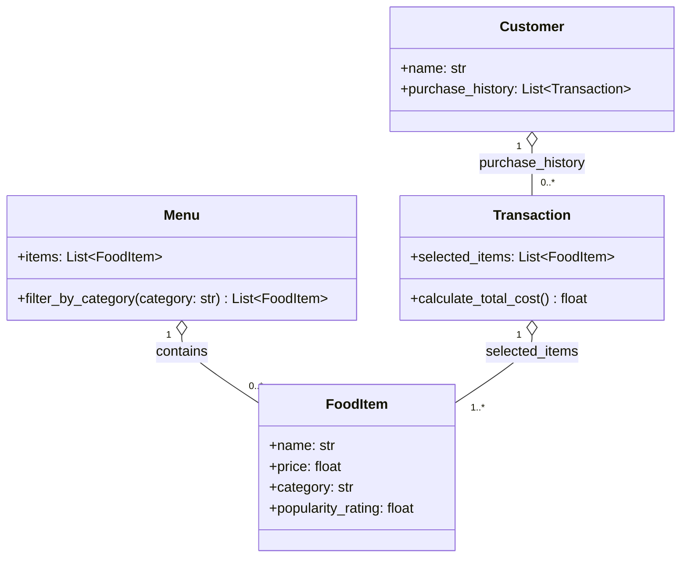

# ByteBites Class Diagram Draft

```mermaid
classDiagram
class Customer {
  +name: str
  +purchase_history: List~Transaction~
}

class FoodItem {
  +name: str
  +price: float
  +category: str
  +popularity_rating: float
}

class Menu {
  +items: List~FoodItem~
  +filter_by_category(category: str) List~FoodItem~
}

class Transaction {
  +selected_items: List~FoodItem~
  +calculate_total_cost() float
}

Menu "1" o-- "0..*" FoodItem : contains
Transaction "1" o-- "1..*" FoodItem : selected_items
Customer "1" o-- "0..*" Transaction : purchase_history
```
